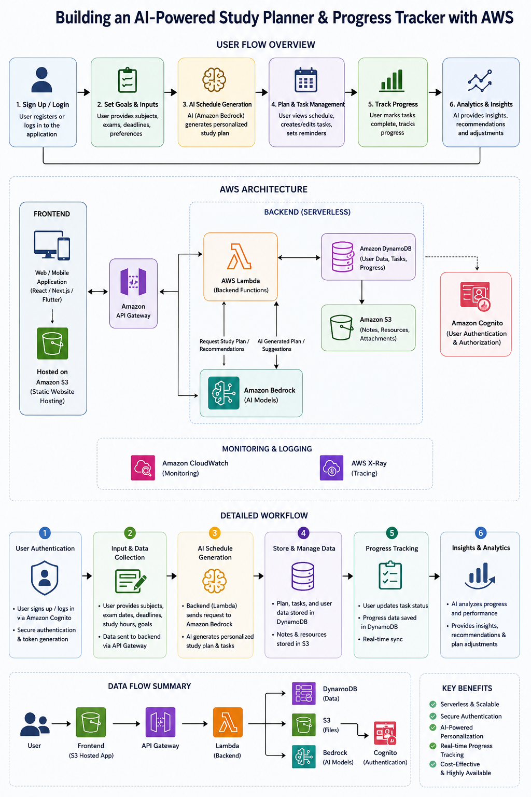

# FocusGeek — AI-Powered Study Planner & Learning Assistant

> A personal academic assistant that helps students plan studies, stay focused, and track exam readiness.

---

## 📌 Project Overview

FocusGeek is a full-stack AI-powered study planner built for students managing multiple subjects and exam deadlines. The goal is to combine smart scheduling, note-based learning, and focus tracking into one platform.

This project is currently in the **planning and design phase** as part of a 6-week builder program.

---

## 🎯 Problem Statement

Students struggle with:

- Managing multiple subjects at the same time
- Creating realistic study plans around exams
- Staying focused while studying
- Knowing how prepared they actually are for an exam

---

## 💡 Proposed Solution

An AI-powered web app with five core modules:

1. **Study Planner** — AI-generated daily/weekly schedules based on exam dates and available hours
2. **Notes Assistant** — Upload notes and ask questions; AI answers from your own content (RAG)
3. **Focus Mode** — Pomodoro timer with session tracking and focus score
4. **Quiz Generator** — Auto-generate quizzes from uploaded notes
5. **Readiness Score** — Calculated from syllabus completion, study hours, and quiz performance

---

## 🛠️ Planned Tech Stack

| Layer | Technology |
|-------|-----------|
| Frontend | Next.js, TypeScript, Tailwind CSS |
| Backend | AWS Lambda, API Gateway |
| Database | Amazon DynamoDB |
| Auth | Amazon Cognito |
| File Storage | Amazon S3 |
| AI | Amazon Bedrock |

---

## 📐 Wireframes & System Design

> 

---

## 🗺️ Roadmap

- [x] Project idea finalized
- [x] Wireframes designed
- [x] System design diagram created
- [ ] Authentication setup
- [ ] Dashboard UI
- [ ] Subject & Task management
- [ ] AI Schedule Generator
- [ ] Notes upload & AI chat
- [ ] Focus Mode
- [ ] Quiz & Readiness Score
- [ ] Deployment on AWS

---

## 👤 Author

**Varnika Yadav and Jayanti Goyal**
B.Tech Computer Science · Semester 5

- GitHub: [@Codejourn](https://github.com/Codejourn)
- LinkedIn: [your-profile](www.linkedin.com/in/varnika-yadav-8620a9327)

---

  Part of the 6-Week Builder Program · Week 2

