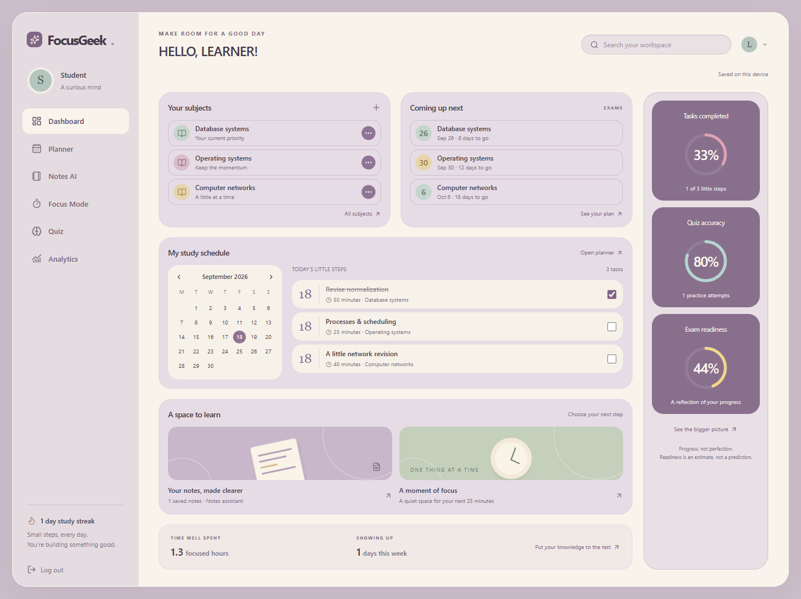
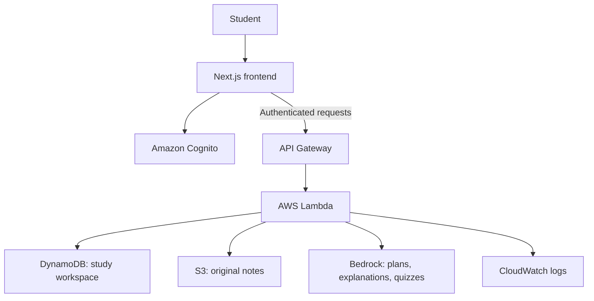

# FocusGeek

### A little structure. A lot more focus.

FocusGeek is a study-management app that helps students decide what to study, learn from their notes, practise with quizzes, and understand their exam preparation. It brings the cycle of **plan → study → learn → test → reflect** into one calm workspace.

The interface uses a warm cream and muted lavender palette, compact subject cards, a calendar-based schedule, and progress rings. It is designed for desktop and mobile.



_Dashboard preview with sample data in a local workspace._

## What you can do

- **Plan your studies:** manage subjects, exam dates, priorities, and daily available hours. Generate a study plan with Amazon Bedrock or use the local deadline-based scheduler.
- **Learn from your notes:** upload notes, read them, search passages, and ask Bedrock questions about the extracted content.
- **Test your understanding:** generate quizzes by subject, difficulty, and optional notes. Submit answers, review explanations, and keep a performance history.
- **Make time to focus:** run a Pomodoro timer with pause, resume, and reset. Completed sessions contribute to your recorded study hours.
- **See your progress:** track completed tasks, quiz accuracy, focused hours, consistency, and an exam-readiness estimate.

## Tech stack

| Layer                   | Technologies                                                       |
| ----------------------- | ------------------------------------------------------------------ |
| Frontend                | Next.js 16, React 19, TypeScript, Tailwind CSS 4                   |
| Animation and charts    | Framer Motion, Recharts, Lucide icons                              |
| Authentication          | Amazon Cognito, AWS Amplify                                        |
| Backend                 | Python 3.13, AWS Lambda, API Gateway                               |
| Storage                 | DynamoDB for workspace data; private S3 storage for original notes |
| Generative AI           | Amazon Bedrock, Nova Lite via an APAC inference profile            |
| Infrastructure and logs | AWS SAM, CloudFormation, CloudWatch                                |
| Testing                 | Node test runner, Python unittest, Playwright                      |

## Quick start

Requires **Node.js 22.17 or newer** and npm.

```bash
git clone https://github.com/Codejourn/AI-Study-Planner.git FocusGeek
cd FocusGeek
npm ci
```

Copy `.env.example` to `.env.local` if you do not already have an environment file:

```powershell
# Windows / PowerShell
if (!(Test-Path .env.local)) { Copy-Item .env.example .env.local }
```

```bash
# macOS / Linux — preserve existing configuration
[ -f .env.local ] || cp .env.example .env.local
```

Start the frontend:

```bash
npm run dev
```

Open **http://localhost:3000**.

### Local workspace

Leave the three environment values empty. Open `/login` and choose **Try FocusGeek locally**. No AWS account or credentials are required.

Local mode supports subjects, tasks, deadline-based scheduling, TXT/Markdown notes with passage search, a fixed DBMS practice quiz, focus sessions, and analytics. Local scheduling, search, and the practice quiz do **not** call generative AI.

Data stays in this browser. Clearing browser storage removes it, and local mode does not sync across devices.

### AWS workspace

Configure the public identifiers from your AWS stack:

```dotenv
NEXT_PUBLIC_COGNITO_USER_POOL_ID=
NEXT_PUBLIC_COGNITO_CLIENT_ID=
NEXT_PUBLIC_API_URL=
```

Restart Next.js after changing environment values. Create an account at `/signup`, confirm the email code, and sign in.

**Use Save to cloud after making changes.** The app loads your cloud workspace at sign-in and reload. Edits are cached locally, but DynamoDB persistence currently requires an explicit save. If another device saves first, your stale save is rejected; export your changes before reloading.

AWS access keys are **not frontend configuration**. The frontend authenticates with Cognito, and Lambda accesses AWS services through its execution role. Deployment commands use the credentials configured in the AWS CLI. Never commit `.env.local`, credential files, or test-account passwords.

## How it fits together


```mermaid
flowchart TD
    Student[Student] --> Frontend[Next.js frontend]
    Frontend --> Cognito[Amazon Cognito]
    Frontend -->|Authenticated requests| API[API Gateway]
    API --> Lambda[AWS Lambda]
    Lambda --> DB[DynamoDB: study workspace]
    Lambda --> S3[S3: original notes]
    Lambda --> AI[Bedrock: plans, explanations, quizzes]
    Lambda --> Logs[CloudWatch logs]
```

The backend takes account ownership from verified Cognito claims. It validates incoming workspace data and generated quiz/schedule structures, enforces upload and workspace size limits, and checks revisions before saving.

## Project structure

```text
app/                    Landing, auth, dashboard and feature pages
components/             Navigation, app shell and shared UI
context/                Authentication and study workspace state
lib/                    API client, Cognito config and study calculations
backend/
  handler.py            Authenticated Lambda API
  template.yaml         AWS SAM infrastructure
  requirements.txt      Lambda dependencies
  test_handler.py       Backend unit tests
tests/
  study.test.mjs        Scheduler, storage and metrics tests
  browser/              Browser study-workflow test
docs/
  AWS-SETUP.md           Deployment, operations and cleanup
  PROGRESS.md            Current progress and remaining work
```

## Development and verification

| Command            | Purpose                                                |
| ------------------ | ------------------------------------------------------ |
| `npm run dev`      | Run the development server                             |
| `npm run build`    | Build the production frontend                          |
| `npm start`        | Serve a production build                               |
| `npm run lint`     | Check frontend code with ESLint                        |
| `npm test`         | Test scheduling, storage validation, and study metrics |
| `npm run test:e2e` | Run the browser workflow against a running frontend    |
| `npm run format`   | Format frontend code and infrastructure                |

Backend tests:

```bash
python -m venv .venv
# Activate the environment for your shell, then:
python -m pip install -r backend/requirements.txt
python -m unittest discover -s backend -p 'test_*.py'
```

The cloud browser test needs `FOCUSGEEK_E2E_EMAIL` and `FOCUSGEEK_E2E_PASSWORD` for a **dedicated test account**; it creates study records. It is skipped when these values are absent. Windows uses installed Chrome. Other platforms need `npx playwright install chromium`.

The local dashboard browser test uses `FOCUSGEEK_E2E_LOCAL=1` and `FOCUSGEEK_E2E_URL` pointing to a frontend started with all three AWS environment values empty. It exercises calendar navigation, search, task completion, and responsive layouts without cloud access.

## Deployment

Infrastructure commands and configuration are documented in [AWS setup](docs/AWS-SETUP.md). A stack named `focusgeek` was deployed in Mumbai (`ap-south-1`) on September 18, 2026. The local environment in this workspace is connected to that stack; public repository checkouts do not include those values.

The frontend currently runs locally. For Vercel, set the three public environment values, publish the frontend, and update `FrontendOrigin` in the AWS stack to the exact deployed origin. The current API CORS origin is `http://localhost:3000`.

Deployment creates billable AWS resources. DynamoDB and S3 are retained when the application stack is deleted; see the cleanup instructions before removing resources.

## Readiness calculation

Readiness combines four recorded signals:

| Signal                                               | Weight |
| ---------------------------------------------------- | ------ |
| Task completion                                      | 40%    |
| Quiz accuracy                                        | 35%    |
| Focused study time against the last seven days' goal | 15%    |
| Active study days in the last seven days             | 10%    |

Missing activity contributes zero. This is a transparent **progress estimate**, not an exam-result prediction or a measurement of syllabus coverage.

## Current limits and next steps

- Cloud notes accept PDF, TXT, and Markdown up to 2 MB. PDFs must have extractable text and at most 100 pages. Scans, encrypted PDFs, OCR, DOCX, and PPT are not supported.
- The cloud working extract is limited to 20,000 characters. Q&A uses that extract; vector retrieval over complete documents is future work.
- Cloud workspace storage is capped at 280 KB. Separate record collections and automatic saving are future improvements.
- Removing a note from the workspace leaves its original in S3.
- Leaving or reloading the Focus page cancels an incomplete timer session. Background tabs are supported.
- Quizzes are graded in the browser for personal practice, rather than secured assessment.
- Remaining release work includes Vercel hosting, syllabus tracking, account recovery, and per-user AI quotas.

See [the progress report](docs/PROGRESS.md) for the implemented workflow and verification history.

## Authors

**Varnika Yadav and Jayanti Goyal**
